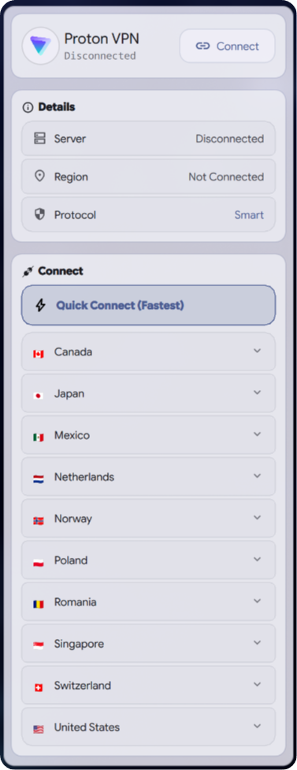
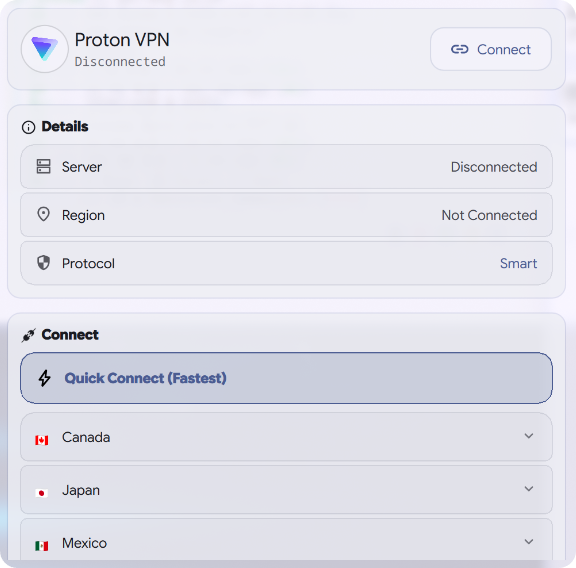
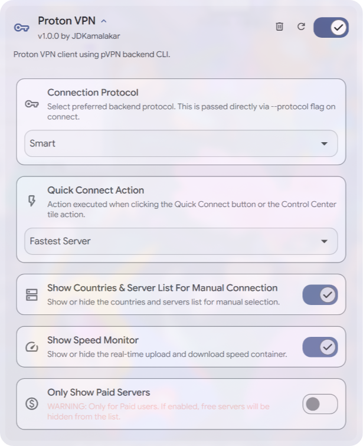

# [DMS-Proton_VPN](#)

### Premium Proton VPN Management

Connect, monitor, and manage your Proton VPN connections – easier than ever on the Dank Material Shell.

## Requirements

- **[pVPN CLI](https://github.com/YourDoritos/pVPN)** installed and logged in on your system (`pvpnctl`).

## Download

## Features

- **Instant & Quick Connect**: One-click connection to the fastest, country-fastest, or custom Proton VPN servers.
- **Real-time Monitoring**: Live tracking of current IP, server location, protocol, and real-time upload/download speeds.
- **Seamless Action Header**: Grouped action controls with dynamic corner animations for Connect, Disconnect, and Reconnect.
- **Auto-Focused Country Search**: Persistent search field inside the country selection list for fast keyboard filtering.
- **Material Aesthetics**: Smooth glassmorphic design and micro-animations styled natively for DMS.
- **Deep Customization**: Separate toggles for Connect and Speed containers, protocol overrides, and paid server filters.

## Interface

  
  

## Configuration

  

## Contributing

Pull requests are welcome. For major changes, please open an issue first to discuss what you would like to change.

Before reporting a new issue, take a look at the [FAQ](https://github.com/JDKamalakar/DMS-Proton_VPN/wiki), the [changelog](https://github.com/JDKamalakar/DMS-Proton_VPN/releases) and the already opened [issues](https://github.com/JDKamalakar/DMS-Proton_VPN/issues).

### Credits

Built with ❤️ for the [Dank Material Shell](https://github.com/DankMaterialShell) community.

### Disclaimer

The developer(s) of this application does not have any affiliation with Proton AG or Proton VPN, and this application provides a UI for the [pVPN](https://github.com/YourDoritos/pVPN) CLI utility.

### 📜 License

Part of DankMaterialShell. Check the main repository for license information.

